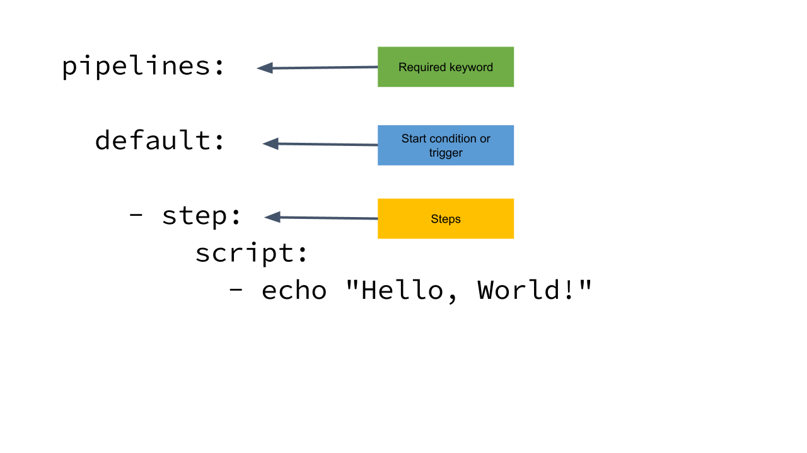

# 01_02 Bitbucket Configuration Overview

Bitbucket pipelines are configured in a file at the root of the repository named `bitbucket-pipelines.yml`.

- Located in the root of the repository
- Tracked as code along with other files
- YAML Format

At the minimum, a pipeline configuration includes:

- The required keyword “pipelines”
  - identifies the start of specific pipeline configurations

- A start condition, referred to as a trigger
  - used to start pipelines

- Steps that the pipeline will complete
  - units of execution within a pipeline.  This is where the commands, scripts, or other specific actions are carried out.  

    

## SHENANIGANS! :D

If you ever want to check your pipeline for errors, use the [validator for bitbucket-pipelines.yml](https://bitbucket-pipelines.prod.public.atl-paas.net/validator).

## References

- [Bitbucket Pipelines configuration reference](https://support.atlassian.com/bitbucket-cloud/docs/bitbucket-pipelines-configuration-reference/)

- [A YAML Syntax reference](https://www.linode.com/docs/guides/yaml-reference/)

- [YAML for beginners](https://www.redhat.com/sysadmin/yaml-beginners)

<!-- FooterStart -->
---
[← 01_01 Create a Pipeline](../01_01_create_a_pipeline/README.md) | [01_03 Configure Pipeline Stages →](../01_03_configure_pipeline_stages/README.md)
<!-- FooterEnd -->
