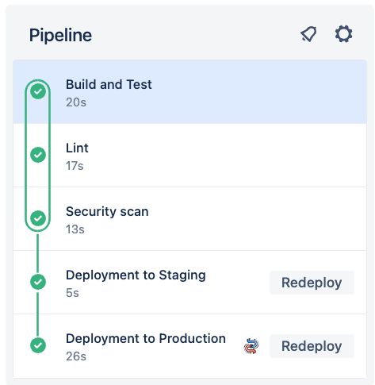
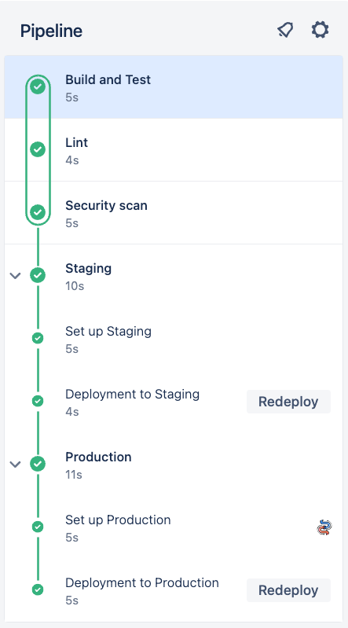

# 01_03 Configure Pipeline Stages

If our deployments include multiple steps, we can group them together using stages.

Use the configuration for this lesson to update the pipeline configuration.
    - [`bitbucket-pipelines.yml`](./bitbucket-pipelines.yml)

The new configuration uses the `stage` keyword to group all the steps together for the "staging" and "production" deployments.

The `manual` trigger is also removed.

## Pipeline before update

## Pipeline after update

<!-- FooterStart -->
---
[← 01_02 Bitbucket Configuration Overview](../01_02_bitbucket_piplines_configuration/README.md) | [01_04 Configure Pipeline Triggers →](../01_04_configure_pipieline_triggers/README.md)
<!-- FooterEnd -->
