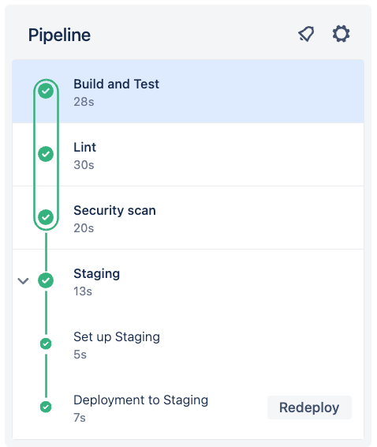
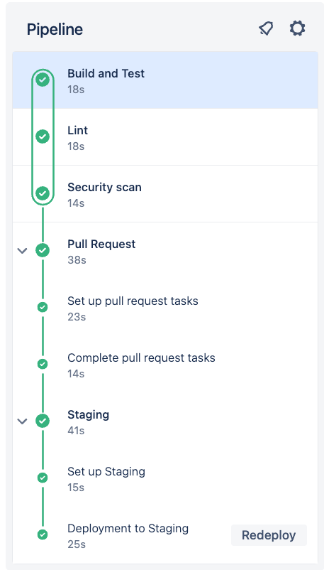
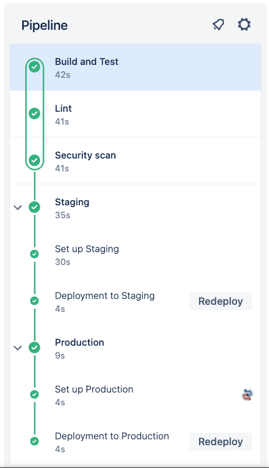
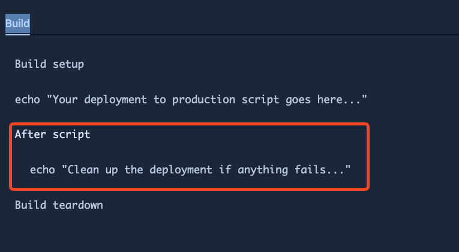
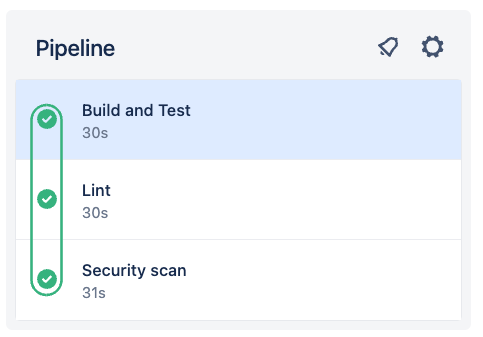

# 01_04 Configure Pipeline Triggers

The most common triggers are:

- `default`
- `branches`
- `pull-requests:`

## `default` trigger

The default trigger is probably the most common pipeline start condition.  Often, it's referred to as a commit trigger.  

```yaml
pipelines:
default:
```

## `branches` trigger

The branches trigger is used to run pipeline steps when a specific branch is updated.

- Patterns and wildcards can be used to match multiple branches.

    ```yaml
    pipelines:
      branches:
        main:
        - steps:
            …
        develop:
        - steps:
            …
        feature/*:
        - steps:
            …
    ```

## `pull-requests` trigger
Runs pipelines when a pull request is created.

- *For pull requests, the branch name pattern is applied to the branch representing the **source** of the pull request; not the target branch.*

    ```yaml
    pipelines:
      pull-requests:
        main:
        - steps:
            …
        develop:
        - steps:
            …
        feature/*:
        - steps:
            …
    ```

## Additional triggers

- `after-script` triggers
  - used in steps to run commands after all other script commands have completed successfully or in failure.

- `manual` triggers
  - used to require a user to click a button in the Bitbucket web interface.
  - can’t be used in the very first stage or step in a pipeline.  
  - can only be confirmed by someone with write access to the repository where the pipeline is running.

## Pipeline configuration with multiple triggers

To experiment with triggers, add the following configuration to the repo:

- [bitbucket-pipelines.yml](./bitbucket-pipelines.yml)

Then complete the following steps:

1. Create a feature branch.
1. Make changes to the files in the repo and commit the changes.
1. Use the feature branch to create a pull request.
1. Merge the pull request back into the main branch.
1. Create a "hotfix" branch.
1. Make changes to the files in the repo and commit the changes.

Use the following sections as references for the pipelines that are run for each trigger.

### Feature branch pipeline run



### Pull request pipeline run



### Main branch pipeline run (after merge)



The updated pipeline includes `after-script` triggers for the "staging" and "production" stages.



### Default pipeline run




<!-- FooterStart -->
---
[← 01_03 Configure Pipeline Stages](../01_03_configure_pipeline_stages/README.md) | [01_05 Use YAML Anchors →](../01_05_use_yaml_anchors/README.md)
<!-- FooterEnd -->
