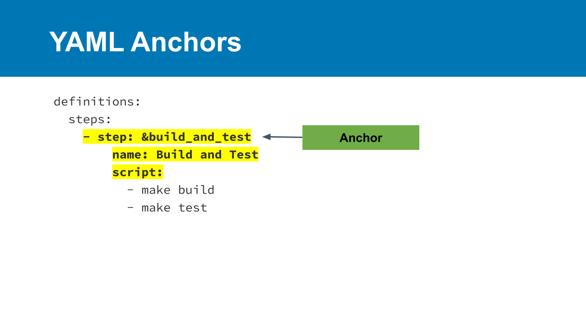
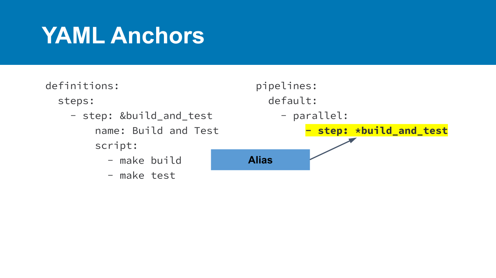
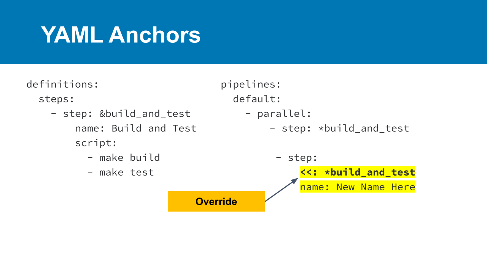

# 01_05 Use YAML Anchors

To keep our pipeline configurations DRY ("Don't Repeat Yourself"), we can use YAML anchors to create reusable steps.

- YAML anchors are placed in the definitions block at the beginning of a pipeline configuration file.
- Anchors are referenced using the anchor’s alias.
- Some values of an anchor can be overridden

## YAML anchor definition

## YAML anchor alias

## YAML anchor override

## SHENANIGANS! :D

Previously, this very document includes the following statement:

> YAML anchors are placed in the **definitions** block at the **beginning** of a pipeline configuration file.

Actually, the `definitions` block of a pipeline can be placed anywhere in the pipeline configuration, as long as the resulting YAML is valid.  So it can actually be placed at the end of the pipeline configuration.

The best approach is to pick a style that works for you (definitions at the beginning or end) and stick to it.

## References

- [A YAML Syntax reference](https://www.linode.com/docs/guides/yaml-reference/)
- [YAML Anchors, Aliases, and Overrides](https://www.linode.com/docs/guides/yaml-anchors-aliases-overrides-extensions/)

<!-- FooterStart -->
---
[← 01_04 Configure Pipeline Triggers](../01_04_configure_pipieline_triggers/README.md) | [01_06 Challenge: Create a Pipeline →](../01_06_challenge/README.md)
<!-- FooterEnd -->
