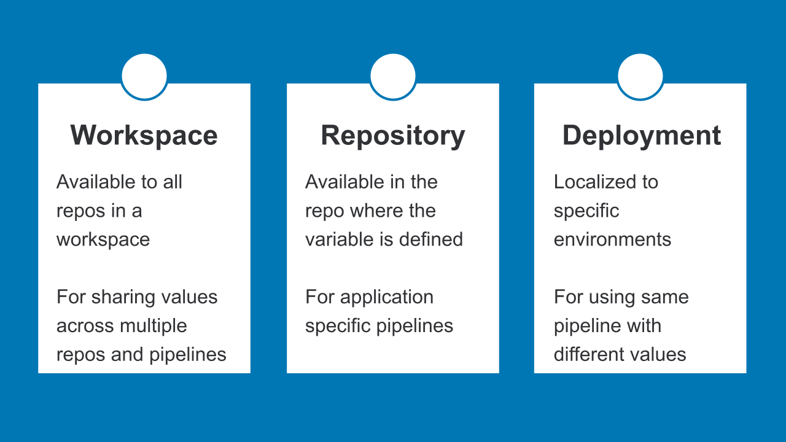
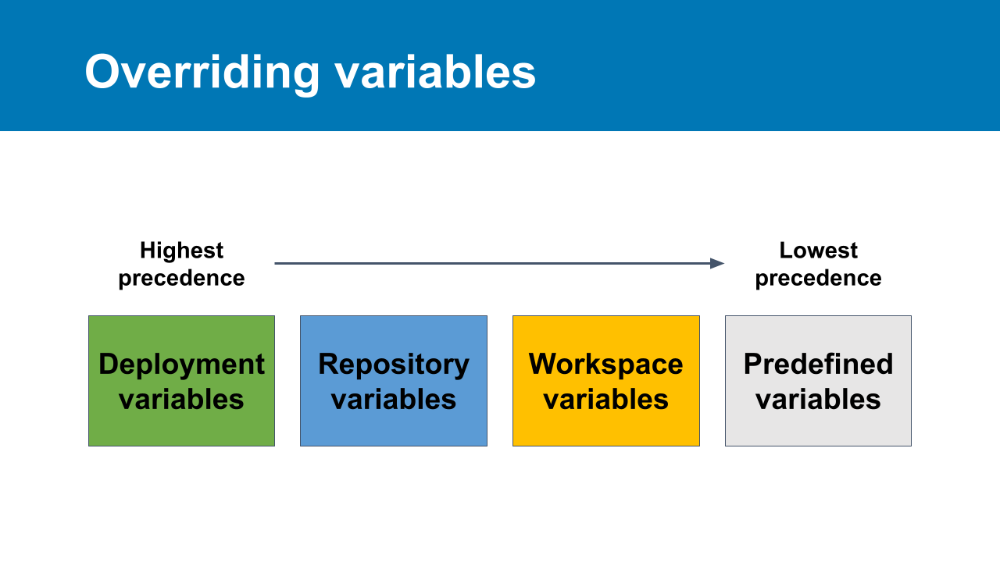

# 02_01 Using Variables and Secrets

To keep our pipelines flexible, we can use variables.

We refer to variables in our pipeline configuration using a dollar sign character followed by the variable name.

- Use all caps to easily identify variables
  - `$VARIABLE_NAME`

- Variables may also be wrapped in curly braces
  - `${VARIABLE_NAME}`

## Predefined variables

Each pipeline comes with a set of predefined or default variables that we can refer to as needed in steps and scripts.

- Follow the link in the [references](#references) section of this document for a complete list of predefined variables.

## User-defined variables

Bitbucket users can define variables to pass configuration details into pipelines at run time.

## Secrets

Secrets are special variables that protect sensitive details like API Keys and passwords.

Secret values are obscured in pipeline logs and output.

## Locations for defining variables

Pipeline variables can be defined in the following locations:

- Workspace
- Repository
- Deployment

  

## Overriding variables

Variables can be overridden if the same name is defined in multiple locations.

For overrides, the order of precedence from highest to least is:

- deployment variables
- repository variables
- workspace variables
- predefined variables

  

## References

- [Variables and Secrets](https://support.atlassian.com/bitbucket-cloud/docs/variables-and-secrets/)

<!-- FooterStart -->
---
[← 01_07 Solution: Create a Pipeline](../../ch1_pipelines/01_07_solution/README.md) | [02_02 Using Deployment Variables →](../02_02_deployment_vars/README.md)
<!-- FooterEnd -->
