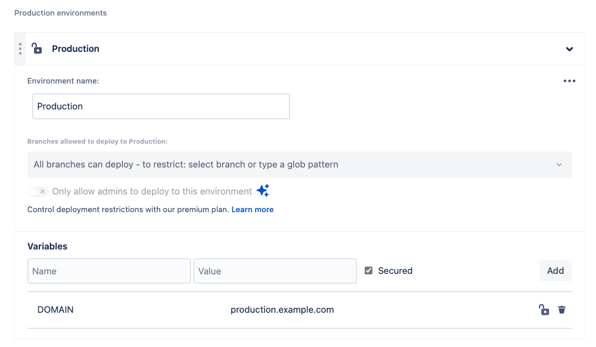
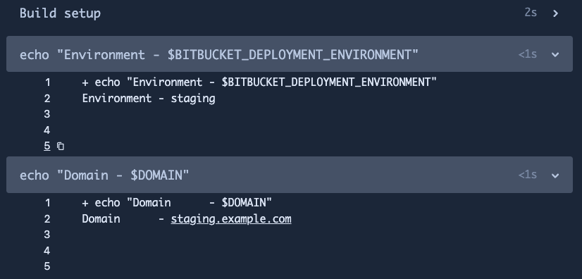

# 02_02 Using Deployment Variables

Deployment variables allow us to develop pipelines that use the same steps for different environments.

By using override capabilities, we can use the same variable name with different values for the targeted environments.

## Demonstration

1. Update the **Deployment** setting for the repo by adding the same variable, `DOMAIN`, to the **Test**, **Staging**, and **Production** deployment environments:

    - `test.example.com`
    - `staging.example.com`
    - `production.example.com`

    

1. Add the provided pipeline configuration to the repo:

    - [bitbucket-pipelines.yml](./bitbucket-pipelines.yml)

1. Run the pipeline and observe the output from the pipeline steps.

    

<!-- FooterStart -->
---
[← 02_01 Using Variables and Secrets](../02_01_variables_and_secrets/README.md) | [02_03 Pipeline Artifacts →](../02_03_artifacts/README.md)
<!-- FooterEnd -->
