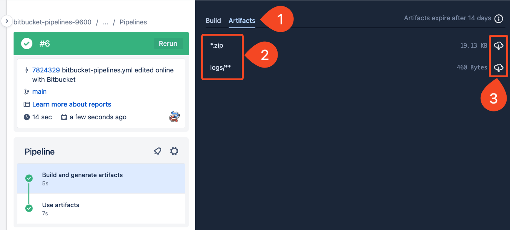
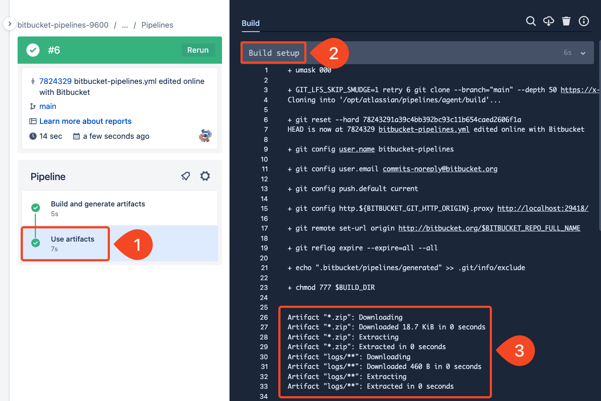

# 02_03 Pipeline Artifacts

Files written to disk by a step are called **artifacts**.

Some examples are:

- Compiled executables
- Archives (ie, JAR, TAR, and Zip files)
- Text logs and reports

## Creating artifacts

Pipelines identify artifacts using `artifacts` block followed by a list of files.

- *Variables can’t be used in the artifacts list.*
- Use wildcards with an extension to capture known files with varying names. Surround wildcard items with quotes.

```yaml
- step:
    name: Build and generate artifacts
    script:
      - mkdir logs
      - date > logs/log-$BITBUCKET_BUILD_NUMBER.txt
      - echo "Creating zip archive" >> logs/log-$BITBUCKET_BUILD_NUMBER.txt
      - zip -r ./archive-${BITBUCKET_COMMIT}.zip .
      - stat ./archive-${BITBUCKET_COMMIT}.zip >> logs/log-$BITBUCKET_BUILD_NUMBER.txt
    artifacts:
      - '*.zip'
      - logs/**
```

## Using artifacts

After an artifact is created, we can access it in any following steps.

- *If an artifact is created in a previous steps, it is downloaded by all following steps.*

```yaml
- step:
    name: Use artifacts
    script:
      - echo "Using artifact from previous step"
      - cat logs/log-$BITBUCKET_BUILD_NUMBER.txt
      - mkdir target
      - unzip archive-${BITBUCKET_COMMIT}.zip -d ./target
```

## Demonstration

1. Add the provided pipeline configuration to the repo:

    - [bitbucket-pipelines.yml](./bitbucket-pipelines.yml)

1. Observe the pipeline output including:

    - The artifacts tab on the step where artifacts are created.

        

    - The details for the downloaded artifact in the `Use artifacts` step.

        

## SHENANIGANS! :D

### Preventing artifact downloads

The default behavior for pipeline steps is to download artifacts from all previous steps.  You can turn this off by configuring the `artifacts` setting for a step to the value `false`:

```yaml
- step:
    name: Skip artifact download
    script:
        - echo "Artifacts will not be downloaded..."
    artifacts:
        download: false
```

### Artifacts and parallel steps

If an artifact is created in a parallel step, the artifact can't reliably be consumed in another parallel step.

Because the order of the steps is not known, the step looking for the artifact might run before the artifact is available causing the step (and perhaps even the pipeline) to fail.

Bottom line: don't try to create and access artifacts in parallel steps.

The following documentation has the specifics:

- [Step options: Artifact downloads](https://support.atlassian.com/bitbucket-cloud/docs/step-options/#Artifact-downloads)

## References

- [Pipeline Artifacts](https://support.atlassian.com/bitbucket-cloud/docs/use-artifacts-in-steps/)
- [Step options: Artifacts](https://support.atlassian.com/bitbucket-cloud/docs/step-options/#Artifacts)


<!-- FooterStart -->
---
[← 02_02 Using Deployment Variables](../02_02_deployment_vars/README.md) | [02_04 Packages →](../02_04_packages/README.md)
<!-- FooterEnd -->
