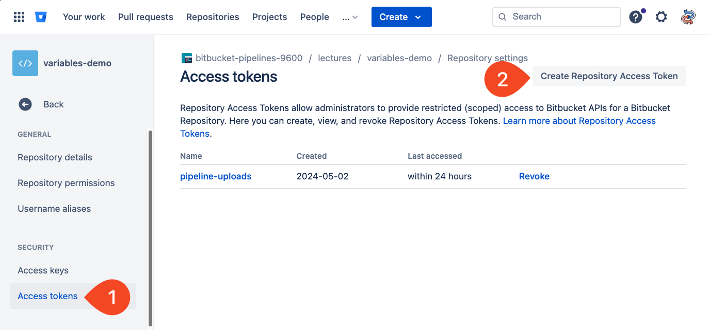

# 02_04 Packages

Artifacts are best used within a pipeline.  For long term usage, packages are the better option.

## Artifacts vs Packages

Packages provide:

- access from a consistent location
- indefinite availability (keeping storage limits in mind)
- default packages for the repository and its branches

## Creating packages

To create a package from a pipeline, the package is "uploaded" to the repository's storage space.  This requires:

- Write access to the repo
- An access token with the proper access

Uploading a package from a pipeline can be simplified by using a Bitbucket Pipe.

## Access tokens

Review the following documentation for details on creating an access token:

- [Create a Repository Access Token](https://support.atlassian.com/bitbucket-cloud/docs/create-a-repository-access-token/)

Store the token in a repository variable for access from pipelines.

## Bitbucket Pipes

Bitbucket pipes are Docker images designed specifically for use as steps in Bitbucket pipelines.

An in-depth discussion of pipes is beyond the scope of this course.

Review the following support article for more information on pipes:

- [Bitbucket Support: What are pipes?](https://support.atlassian.com/bitbucket-cloud/docs/what-are-pipes/)

## Demonstration

1. Create an access token with write permissions.

    

1. Store the token in a repository variable.

    

1. Add the provided pipeline configuration to the repo and run the pipeline:

    - [bitbucket-pipelines.yml](./bitbucket-pipelines.yml)

1. Review the pipeline output, noting the step where the pipe is used along with its output.

    

    

1. Review the listing for the package on the repo's **Downloads** page.

    

## References

- [Repository Access Tokens](https://support.atlassian.com/bitbucket-cloud/docs/repository-access-tokens/)

    > Repository Access Tokens are per-repository passwords for scripting tasks and integrating tools (such as CI/CD tools) with Bitbucket Cloud. Repository Access Tokens are designed for use with a single application with limited permissions, so they don't require two-step verification (2SV, also known as two-factor authentication or 2FA). Repository Access Tokens are tied to a repository, not a user’s account. This restricts the token’s access to a single repository, providing a more secure solution than user-based authentication methods such as App passwords.

- [Access Tokens](https://support.atlassian.com/bitbucket-cloud/docs/access-tokens/)

    > Access Tokens are linked to a repository, project, or workspace. They can be used for scripting tasks and integrating tools (such as CI/CD tools) with Bitbucket Cloud. Access Tokens are designed to be used for a single application with limited permissions, so they don't require two-step verification (2SV, also known as two-factor authentication or 2FA).

- [Deploy build artifacts to Bitbucket Downloads](https://support.atlassian.com/bitbucket-cloud/docs/deploy-build-artifacts-to-bitbucket-downloads/)

- [Pipe: bitbucket-upload-file](https://bitbucket.org/atlassian/bitbucket-upload-file/src/master/)

<!-- FooterStart -->
---
[← 02_03 Pipeline Artifacts](../02_03_artifacts/README.md) | [02_05 Challenge: Deploy an Artifact →](../02_05_challenge/README.md)
<!-- FooterEnd -->
