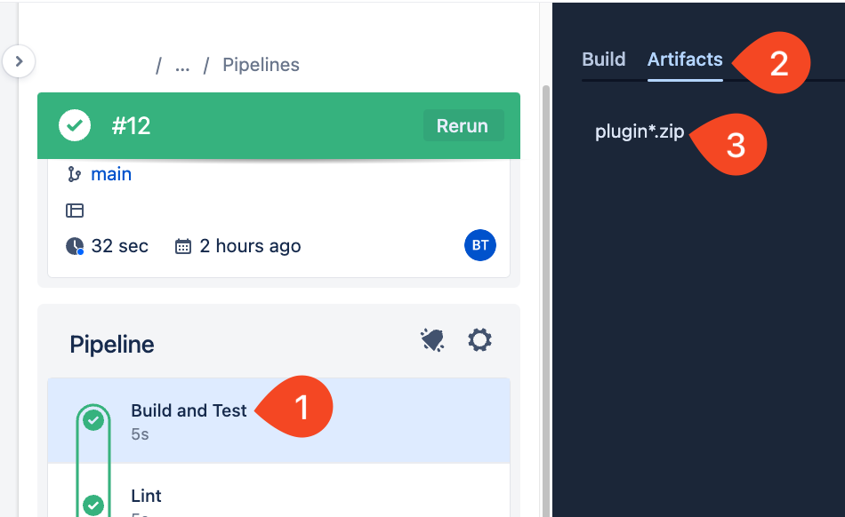
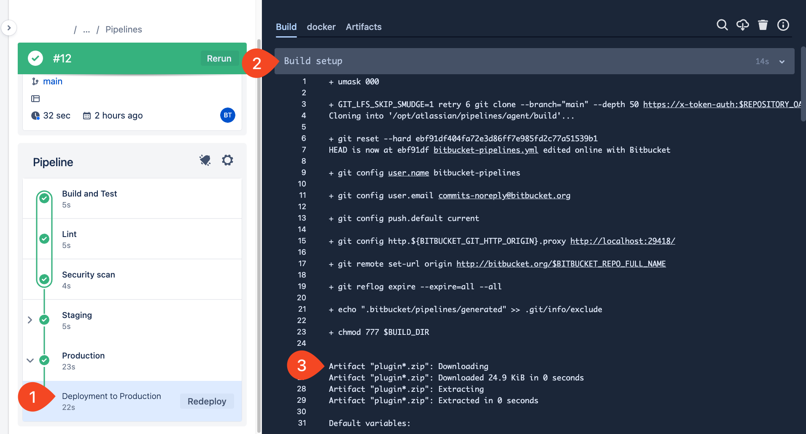
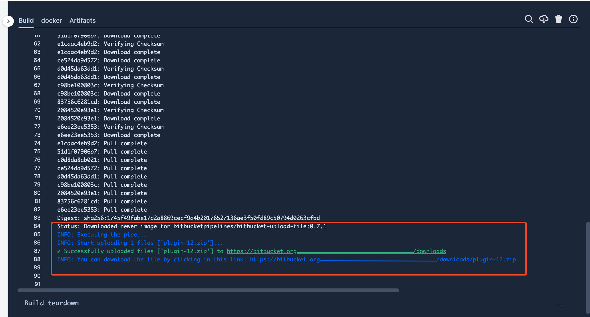
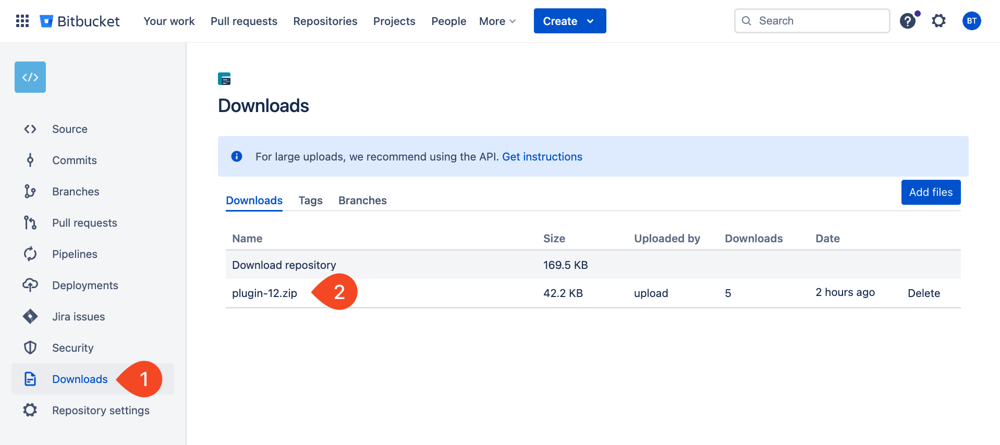

# 02_06 Solution: Deploy an Artifact

## Challenge Scenario

The dev team is making great progress with the pipeline configuration you created in the previous challenge and the rest of the company is buzzing with interest.

Now, the plugin team needs help updating their continuous delivery workflow.  Their goal is to share plugins as packages that anyone in the community can download.

## Challenge Tasks

> *NOTE: If you haven't completed the challenge for Chapter 1, review and complete the steps for [01_07 Solution: Create a Pipeline](../../ch1_pipelines/01_07_solution/README.md) before proceeding with this challenge.*
>
> *TLDR? Create the following:*
>
>- *Workspace, Project, Public repository*
>- *Inside the repo create `bitbucket-pipelines.yml`*
>- *Add this code: [bitbucket-pipelines.yml](../../ch1_pipelines/01_07_solution/bitbucket-pipelines.yml)*

1. Log into Bitbucket and locate the repository you created in the previous challenge.
1. Create an access token.
1. Store the access token securely.
1. Update the pipeline configuration to create an artifact in the "Build and Test" step.  The artifact should be named `plugin-##.zip` where `##` is replaced by the current pipeline build number.

    Use the following code snippet:

    ```yaml
    - step: &build_and_test
        name: Build and Test
        script:
          - echo "Your build and test goes here..."
          - zip -r plugin-$BITBUCKET_BUILD_NUMBER.zip .
        artifacts:
          - plugin*.zip
    ```

1. Update the "Production" stage to create a package using the zip file as an artifact.

    Use the following code snippet:

    ```yaml
    - pipe: atlassian/bitbucket-upload-file:0.7.1
      variables:
        BITBUCKET_ACCESS_TOKEN: $BITBUCKET_ACCESS_TOKEN
        FILENAME: '*.zip'
    ```

1. Confirm that the artifact and package are created successfully.
1. Confirm that the package is available to anyone with the repository URL.

## Solution

### 1. Create the access token and store it securely

1. Start from the repository [created in the previous challenge](../../ch1_pipelines/01_07_solution/bitbucket-pipelines.yml).
1. From the sidebar menu, select **Repository settings**.
1. Under "Security" select **Access tokens**. Then select **Create Repository Access Token**.
  Name the token "Upload".
1. Under "Scopes -> Repositories", select **Write**.
1. Select **Create**.
1. When the token is presented, select the stacked squares icon to copy the token to the clipboard. Then select **Close**.
1. From the sidebar menu, select **Deployments -> Production**.
1. Under "Variables", in the "Name" field, "BITBUCKET_ACCESS_TOKEN".  Paste the value for the token into the "Value" field.  Confirm that **Secured** is selected.  Select **Add**.

### 2. Update the pipeline configuration to create the artifact and package

1. Navigate to the repository **Source** section and edit `bitbucket-pipelines.yml`.
1. Update the "Build and Test" step to contain the following:

    ```yaml
    - step: &build_and_test
        name: Build and Test
        script:
          - echo "Your build and test goes here..."
          - zip -r plugin-$BITBUCKET_BUILD_NUMBER.zip .
        artifacts:
          - plugin*.zip
    ```

1. Update the "Deployment to Production" step to contain the following under the `script:` section:

    ```yaml
    - pipe: atlassian/bitbucket-upload-file:0.7.1
      variables:
        BITBUCKET_ACCESS_TOKEN: $BITBUCKET_ACCESS_TOKEN
        FILENAME: '*.zip'
    ```

1. Commit the changes.

### 3. Confirm that the artifact and package are created successfully

1. Navigate to the repository **Pipelines** section and select the pipeline run for the last commit.
1. Select the **Build and Test** step.  Confirm that the `plugin*.zip` artifact was created.

  

1. Select the **Deployment to Production** step.  Select **Build setup** output and confirm the artifact was downloaded.

  

1. Select the **pipe: atlassian/bitbucket-upload-file:0.7.1** output and scroll to the end of the output. Confirm the pipe completed the upload successfully.

  

### 4. Confirm the package is publicly accessible

1. Navigate to the repository **Downloads** section.
1. Confirm that the package is present.

  

1. Copy the link for the repository and open it in an incognito tab.
1. Confirm that the package can be downloaded.


<!-- FooterStart -->
---
[← 02_05 Challenge: Deploy an Artifact](../02_05_challenge/README.md) | [03_01 Default Images →](../../ch3_build_envs/03_01_default_images/README.md)
<!-- FooterEnd -->
