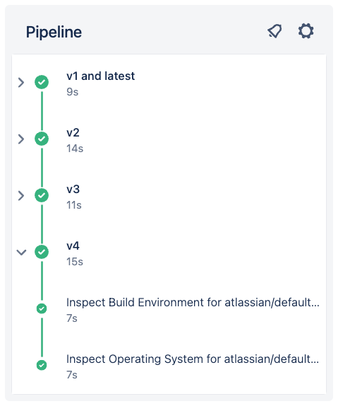

# 03_01 Default Images

Each pipeline step is run in a container.

Containers provide build environments that are:

- consistent
- reproducible
- isolated

## Define pipeline image globally

Containers can be specified globally using the `image` keyword.

Globally defined images are used in each pipeline step if no other image is specified.

```yaml
image: node:22 # GLOBALLY DEFINED IMAGE
pipelines:
  default:
    - step:
        script:
          - npm install
          - npm test
    - step:
        script:
          - npm run build
```

## Define image locally in each step

Containers can be specified at the step level, also by using the `image` keyword.

```yaml
pipelines:
  default:
    - step:
        image: node:22 # IMAGE FOR THIS STEP
        script:
          - npm install
          - npm test
    - step:
        image: python:3.13 # IMAGE FOR THIS STEP
        script:
          - pip install -r requirements.txt
          - pytest
```

## The default pipeline image

If no image is defined, a default image is used.

The default image is:

- maintained by Atlassian
- publicly available on Docker Hub
  - https://hub.docker.com/r/atlassian/default-image
- based on Ubuntu Linux OS

The default image includes standard Linux commands that can be used in pipeline steps.

Additional tools are also installed.

| Categories                  | Tools                              |
|-----------------------------|------------------------------------|
|Build tools                  | `ant`, `gcc`, `node`, `npm`, `nvm` |
|Networking and Data Transfer | `curl`, `wget`, `ssh`, `git`       |
| Utilities                   | `jq`, `tar`, `zip`, `xvfb`         |

## Demonstration

Use the provided configuration to examine the build environment an operating system provided by the different versions of the Atlassian default image:

- [`bitbucket-pipelines.yml`](./bitbucket-pipelines.yml)

    

## SHENANIGANS! :D

## Versions for `default-image`
When this course was initially recorded, the container image used in the Starter Pipeline defaulted to version 3.  However, newer versions are available.  So while the [provided template](./bitbucket-pipelines.yml) may show `atlassian/default-image:3`, you may see different versions used in other pipeline configurations.

To find configuration details, check out the image registry on Docker Hub.

- [Docker Hub: atlassian/default-image](https://hub.docker.com/r/atlassian/default-image/tags)

## Be careful with using `atlassian/default-image:latest`

In most cases, using `latest` with a container image will get you the latest and greatest version.  Unfortunately, the `latest` version for `default-image` is pinned to the very first version of the image.

As a result, the `latest` version uses an older version of Ubuntu (14.04), Python (2.7.6), npm (2.14.7) and other tools.

Check out the entry in the [references](#references) for the complete listing of available images, their versions, and the tools they provide.

## References

- [Use Docker images as build environments ](https://support.atlassian.com/bitbucket-cloud/docs/use-docker-images-as-build-environments/)


<!-- FooterStart -->
---
[← 02_06 Solution: Deploy an Artifact](../../ch2_vars_artifacts/02_06_solution/README.md) | [03_02 Public Images →](../03_02_public_images/README.md)
<!-- FooterEnd -->
