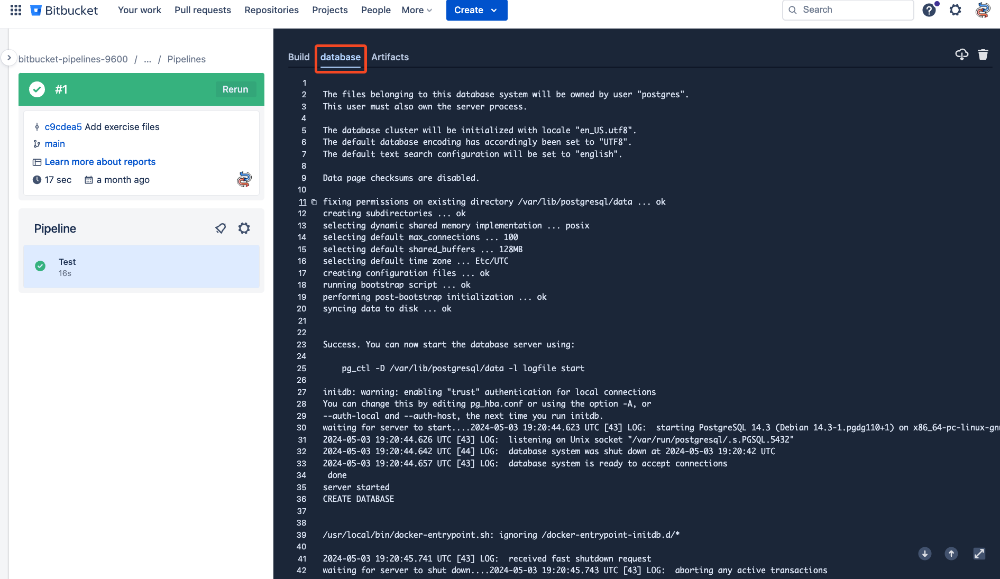

# 03_03 Services

Services are additional containers that run along with the container images running pipeline steps.

Services provide connections to other applications that can be used by the pipeline.

- Databases
- Caches
- Queues

We set up services in the definition section of our pipeline configuration using the services keyword.

```yaml
image: python:3

definitions:
  services:
    database:
      image: postgres:14.3
      environment:
        POSTGRES_DB: 'db'
        POSTGRES_USER: 'db'
        POSTGRES_PASSWORD: 'testingtesting123'
```
Once the service is defined, we can reference the service in any steps where it's needed.

```yaml
- step:
    name: Test
    services:
      - database
    script:
      - pip install pytest psycopg2-binary
      - pytest -s -rPF --junit-xml=test-results.xml
    artifacts:
      - test-results.xml
```
## Service limitations

- Steps are limited to no more than 5 services
- Services may listen on localhost or ‘127.0.0.1’
- Steps don’t wait for services to start; Add wait time as needed

## Demonstration

1. Add the following files to a new bitbucket repo:

    The code for this demo is a python application that connects to a Postgres database.  The pipeline configuration runs the tests for the application.

    - [app.py](./app.py)
    - [app_test.py](./app_test.py)
    - [bitbucket-pipelines.yml](./bitbucket-pipelines.yml)

1. Run the pipeline and examine the output.
1. Note the **database** tab with details and logs from the service.

    

## References
- [Databases and service containers](https://support.atlassian.com/bitbucket-cloud/docs/databases-and-service-containers/)


<!-- FooterStart -->
---
[← 03_02 Public Images](../03_02_public_images/README.md) | [03_04 Challenge →](../03_04_challenge/README.md)
<!-- FooterEnd -->
